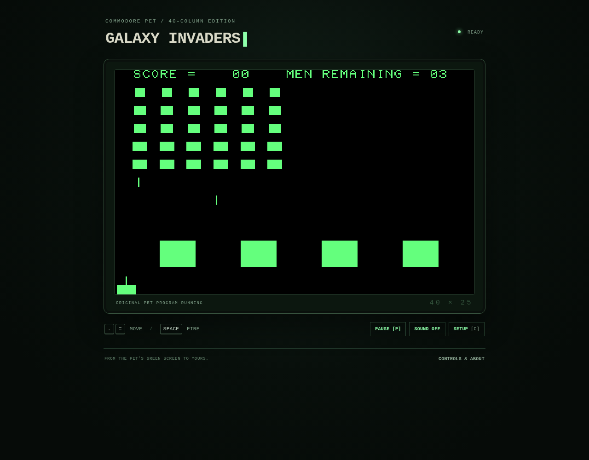

# Galaxy Invaders — original PET character edition

The uploaded PET arcade program now runs as **original 6502 machine code** in the browser. Its entire playfield is the PET's **40-column, 25-row character screen**: 1,000 character cells, rendered with PET glyphs and inverse graphics. The previous generic pixel-sprite recreation has been replaced.



## Play

Download and unzip [Galaxy-Invaders-Browser.zip](Galaxy-Invaders-Browser.zip), then open `index.html` in a modern browser. All assets are local; no account, build, emulator installation, or internet connection is needed. If your browser restricts local HTML, serve this folder:

```sh
python3 -m http.server 8080
```

Then open `http://localhost:8080` in your own browser. `npm start` runs the same server bound to your computer.

| Command | Action |
| --- | --- |
| B / Begin Game | Begin or restart |
| . / = | Original left / right movement |
| Space | Original fire command; release and press again for another shot |
| [ | Original stop command |
| Arrow keys | Alternative movement |
| P / Escape | Pause or resume |
| C / Setup | Change original parameters for the next game |
| E | Stop shortcut (the original BASIC menu used E to exit) |

Touch devices have movement and fire buttons. Changing tabs pauses the game. Setup changes the original number-of-men, initial-column, and delay-counter bytes. Defaults are 20 men, six initial columns, and delay counter 10. The original code handles enemy formations, rack progression, scoring, mystery ships, four shelters, bullets, damage, and game termination.

## What runs

`original/space-invader.prg` is the unmodified 5,783-byte program from the user's `Space Invader.zip`. Its BASIC launcher names the game **Galaxy Invaders** and starts its arcade code with `SYS 3480` (`$0D98`). The PRG loads at `$0401`.

`cpu6502.js` supplies a documented NMOS 6502 instruction interpreter. `game.js` loads the original program, starts at its SYS entry point, and reads its screen memory at `$8000–$83E7`. The executable's self-modifying instructions and original sprite-building character tables run directly. `app.js` draws that character RAM without replacement sprites, extra score graphics, or changes to gameplay rules.

The adapter supplies a nominal 1 MHz CPU clock, a 60 Hz interrupt with register-save/restore wrappers, the active-low keyboard bits read at `$E812`, and a descending timer byte at `$E849`. It provides the IRQ vector expected by the BASIC launcher rather than loading BASIC/KERNAL ROMs. The launcher menu text is reproduced in PET characters; the BASIC interpreter itself does not run. The browser adds pause, touch input, alternate keys, saved parameter preferences, and optional sound approximated from the original VIA/CB2 register values. Sound is initially off. This is a focused adapter for this executable, not a complete or cycle-accurate PET hardware emulator.

## Preserved inputs and provenance

- `original/space-invader.prg`: uploaded original. SHA-256: `6b0e22e95798f28c201c4107c8c4f282b1a6f798d6d7fa4db081ccaf1c560a92`.
- `original/launcher.bas`: readable BASIC launcher listing. Graphics/control bytes appear as `{PETSCII:XX}` placeholders; this is a reference listing, not an importable BASIC file.
- `original/program-info.json`: recovered parameter labels and initial byte values.
- `original/pet-characters.bin`: 2,048-byte Commodore PET character ROM `characters-2.901447-10.bin`, obtained from [VICE's PET data](https://github.com/VICE-Team/svn-mirror/blob/main/vice/data/PET/characters-2.901447-10.bin). SHA-256: `da3374c21d6ea440cef5f338ce3f524e0a1e40dcb1ef64446c695f92c636f1fa`. The renderer uses its first 1,024 bytes (uppercase/graphics) and reverses those glyphs for inverse screen codes.

The supplied game's author has not been identified. The user also provided [this Internet Archive reference](https://archive.org/details/d64_petgame_space_invaders), but access to archive.org was blocked in the development environment. Its executable and screenshots have not been compared with this upload, so this project does not claim the two releases are identical.

## Develop and verify

No runtime dependencies or build step. The original arcade instructions live in `pet-data.js`, embedded so local-file startup requires no fetch or module imports. Regenerate that file from the preserved binaries with:

```sh
python3 tools/embed_assets.py
```

Run the tests with Node.js 18 or newer:

```sh
npm test
```

All **13 tests pass**. The suite compares full 64 KB memory hashes, all CPU registers/cycle counts, and the 1,000-byte screen against **1,040 checkpoints** independently generated with py65. Traces cover idle play, movement/firing/stop, changed original parameters, and a complete game ending. Other tests check binary identity, PET inverse glyphs, pause, restart, Space press/release behavior, and CPU arithmetic/addressing.

The checked-in reference fixtures can be regenerated with Python and `py65==1.2.0` (needed only for this independent validation):

```sh
python3 tools/reference_trace.py > tests/fixtures/reference-trace.json
```

Chromium checks passed for startup over a local HTTP server, exact canvas pixels from character RAM, the original B/=/Space/[ commands, pause/resume, settings/restart, and a 390-pixel touch layout with no JavaScript errors. Managed Chromium blocked `file:` navigation in this environment, so double-click startup was not browser-tested here; the delivery uses classic local scripts and no server-only APIs.

The optional repeatable browser check is `python3 tools/browser_smoke.py` while the local server is running. It requires Python Playwright and Chromium and also exercises actual touch press/release events.
